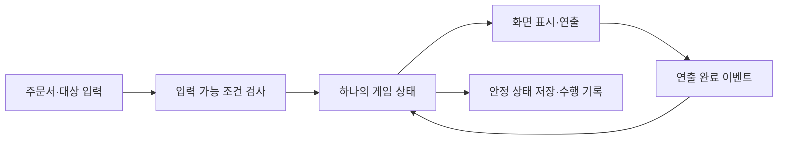

# 0의 주문서 — 기술·구현 계획안

> 작성: 2026-09-29 · T005 검토 중 · 기술 선택 미승인 · 앱 구현 미착수
> 기준: [플레이 명세서](플레이_명세서.md) · [개발 명세서](개발_명세서.md) · [작업 상태](TASKS.md)

## 1. 이번 검토: 기술 구성과 구현 순서

**권장: TypeScript + Vite + HTML/CSS·SVG.** 현재 게임은 두 번 탭, 자막, 정해진 위치의 물건 이동과 장면 전환이 중심이다. 글자·버튼의 CSS 크기를 직접 관리하고, 물건과 숫자의 상태를 한 곳에서 갱신하는 구성이 적합하다. 이는 현재 요구사항에 대한 설계 판단이며 성능 실측 결과는 아니다.

| 분야 | 권장안 | 선택 이유 |
| --- | --- | --- |
| 언어·개발/빌드 | TypeScript + Vite의 `vanilla-ts` 구성 | 상태·장면 데이터의 오류를 타입으로 검사하고 웹 실행·정적 빌드를 구성 |
| 화면 | HTML 버튼·자막, CSS 배치, SVG 임시 인물·물건·마법 효과 | 승인된 글자/입력 크기 유지, 장면 그림 교체, 터치·마우스 대응 |
| 게임 상태 | 단일 상태와 이벤트 처리 함수. 화면·시간·저장은 별도 모듈 | 물건 위치·주문서 그림·0/1의 불일치와 중복 실행 방지 |
| 저장 | 브라우저 IndexedDB, 체크포인트와 관찰 기록을 구분한 저장 구조 | 비동기 저장, 관련 갱신의 트랜잭션 처리. 보관 정책은 5절에서 별도 검토 |
| 검사 | TypeScript 타입 검사 + Vitest + Playwright + 실제 기기 확인 | 규칙·시간·복구와 브라우저 입력/배치를 서로 다른 수준에서 확인 |
| 개발 환경 | Node.js 24 LTS + npm | 지원 중인 LTS 계열을 집·회사 재현 기준으로 사용 |
| 실행 결과 | 정적 웹 파일. 서버 계정·외부 자동 전송 없이 실행 | 승인된 로컬 익명 기록 범위에 맞춤. 공개 호스팅은 별도 결정 |

별도 UI 프레임워크와 게임 엔진은 처음부터 추가하지 않는 안이다. 현재 범위에 없는 물리·충돌·실시간 전투가 필요해지면 엔진 필요성을 다시 판단한다. 음향 연결 지점은 마법 완료 등 기존 이벤트를 이용하되, 음향용 라이브러리·파일·설정은 핵심 검증 후 선택한다. 대사는 ID와 문구를 분리해 후속 TTS를 연결할 수 있게 한다.

2026-09-29 현재 PC는 Node 22.21.1·npm 10.9.4다. Node 24 설치/전환은 하지 않았다. 도구의 정확한 패치 버전은 T005 마무리에서 호환되는 안정판으로 정하고, T006에서 버전 파일·`package.json`·잠금 파일과 실제 실행 결과를 기록한다. `latest`만 적어 다른 PC의 재현 기준으로 삼지 않는다.

## 2. 코드와 상태 처리

아래는 제안 경로이며 아직 파일이 존재하지 않는다.

```text
src/
  main.ts          시작·화면/저장 연결
  game/            상태 타입, 입력 이벤트, 봉인/소환·장면 전이
  content/         S00–S10 구성, 대사 ID·문구, 장면별 대상/배치
  view/            HTML/SVG 표시, 메뉴·대사·주문서
  runtime/         입력, 활성 시간, 연출, 힌트, 창 비활성 처리
  storage/         IndexedDB, 버전 검사, 체크포인트·기록 저장/복구
  observer/        개발·관찰용 기록 열람/입력/JSON/삭제
  styles/          공통 배치·표시 크기
tests/             규칙·시간·저장·브라우저 회귀 검증
public/assets/     교체 가능한 임시 그림, 이후 확정 자산
```



- 도메인 상태가 물건 ID·위치·주문서 내용·장면을 소유한다. DOM과 애니메이션이 숫자나 물건 위치를 따로 확정하지 않는다.
- 봉인/소환 중에는 진행 중 행동과 확정 상태를 분리한다. 승인 시간 끝에 같은 행동 ID를 한 번만 완료 처리하고, 물건·주문서·완료 기록·체크포인트를 함께 갱신한다. 반복 완료 이벤트·연타·두 번째 포인터는 중복 결과를 만들지 않는다.
- 연출은 공통 활성 시간에 맞춰 진행한다. 메뉴 열림·창 비활성에서는 해당 시간을 멈추고 선택과 화면을 유지한다. 힌트 시간은 이 중 조작 가능하면서 유효 진행이 없는 시간만 센다.
- 새로고침·재접속은 시작 화면을 경유해 마지막 완료 지점으로 복원한다. 선택 대기·미완료 마법·미완료 이동은 저장 체크포인트가 아니다. 이어하기/새 세션의 구분은 플레이 11.3절을 따른다.
- 저장은 요청 발행과 트랜잭션 완료를 구분한다. 빠른 연속 갱신의 순서를 유지하고, 관련 체크포인트·수행 기록은 같은 트랜잭션으로 저장한다. 저장 실패 시 메모리의 유효 상태로 계속할 수 있으나 영구 저장 성공으로 표시하지 않는다.
- 관찰 기록을 삭제해도 체크포인트는 남긴다. 세션의 기록 세대/삭제 표식을 분리해, 이어하기나 지연된 쓰기가 삭제한 과거 기록을 되살리지 않게 한다. 구체 필드·JSON 형식·저장 버전 이동은 T005의 기록 상세 검토에서 정한다.
- 터치와 마우스는 공통 Pointer Events로 처리한다. 버튼에는 키보드 의미를 유지하며, 잘못된 대상·빈 배경·메뉴 뒤 입력의 분기는 제품 규칙을 따른다.

## 3. 구현 순서와 단계별 확인 결과

효과음·배경음·소리 설정 검토는 **핵심 기능 구현·검증 뒤**로 이동한다. 2026-09-29 사용자 제안 및 후속 “다음 진행”에 따라 이 작업 순서는 채택했다. 아래 기술·구현 설계 자체는 별도 승인 대기다.

| 단계 | 작업 | 보여 줄 결과·검증 |
| --- | --- | --- |
| 계획 마무리 | T005 | 이번 기술 구성·순서 검토 → 5절의 화면/미정 동작·기록 정책 확정 → 호환 버전·명령 계획 정리 |
| 실행 뼈대 | T006 | 시작 화면·장면·주문서·대사 영역 실행. 설치/실행/빌드 재현과 승인된 크기 확인 |
| 마법 한 바퀴 | T007 | 사과 봉인→1→소환→0. 선택 취소·오입력·연타·메뉴/비활성 중단·결과 동기 확인 |
| 전체 이야기 | T008 + T009 핵심 | 임시 그림으로 S00–S10 연결. 대사 다음·걷기·무거움/가벼움·3/6/10초 힌트·메뉴 확인 |
| 저장과 기록 | T010 | 시작/이어하기/다시 하기·중단 복구·익명 기록·관찰용 열람/내보내기/삭제 확인 |
| 핵심 기능 검수 | T011 1차 | Q01–Q20 중 음향 외 항목과 12.1절 검사. 실제 스마트폰·태블릿·PC 확인 결과와 미실행 구분 |
| 음향 후속 | T004 음향 → T009 음향 → T011 잔여 | 실제 플레이를 보며 효과음/배경음·기본값/설정 보관 결정 후 적용. Q15 소리 부분 검증 |
| 사용 관찰·고도화 | T012, 이후 별도 작업 | 기능 관찰·혼동 개선. 최종 그림·TTS 및 비독자 독립 사용성은 해당 단계에서 검토 |

T004 전체 완료가 기술 계획이나 핵심 구현의 선행 조건은 아니다. 다만 해당 구현에 필요한 미정 제품 동작은 먼저 확정한다. T009·T011은 핵심 부분과 음향 잔여를 나눠 기록하며, 음향 검수를 남긴 상태에서 전체 완료로 표시하지 않는다.

## 4. 검증·실행 계획

- **규칙·시간:** 물건 한 개 불변식, 0/1과 위치 일치, 잘못된 입력의 상태 불변, 단일 완료, 1.2/1.4/1.8/1.2초 및 힌트 3/6/10초 경계, 중단 시간을 제외한 재개를 확인한다.
- **저장·기록:** 안정 상태만 복원, 같은/새 세션 구분, 기록 삭제 후 재생성 방지, 손상·쓰기 실패·용량 초과·중단 시나리오를 검사한다. 마지막 시각 완료가 디스크에 저장되기 전에 탭이 종료될 수 있으므로 최근 저장 완료 체크포인트와 구분한다.
- **브라우저:** Playwright로 Chromium·WebKit·Firefox의 전체 흐름, 배치, 입력·메뉴·새로고침을 확인한다. 실제 Android Chrome·iPhone/iPad Safari·Windows Chrome/Edge의 확인을 별도로 기록한다. 자동 WebKit 검사를 iPhone 실기 통과로 쓰지 않는다.
- **관찰:** 기능 통과와 아동의 독립 사용성은 별도다. 진행자가 자막을 읽어준 경우 외부 도움으로 기록한다.

T006에서 만들 스크립트 이름 제안은 `dev`, `typecheck`, `test`, `test:e2e`, `build`, `preview`다. 최초 구성 후 잠금 파일을 포함하고, 다른 PC에서는 `npm ci`로 재현한다. 지금 실행 가능한 명령이 아니다. 실제 기기 접속은 동일 네트워크의 테스트 서버 또는 승인된 테스트 호스팅으로 검증하며, 주소·방화벽·종료 방법을 개발 명세에 기록한다. 공개 배포는 이번 승인 범위가 아니다.

## 5. 다음에 하나씩 확정할 사항

**이번 승인 범위는 1–4절의 기술 구성·설계 방향·구현 순서다.** 아래 제품 세부값은 별도 검토 항목이며, 이 문서 전체를 읽거나 다음 작업으로 이동한 사실만으로 확정하지 않는다.

| 항목 | 검토할 권장 방향 | 승인 전 경계 |
| --- | --- | --- |
| 지원 화면·세로/작은 창 | 640×320 CSS px를 최소 사용 가능 영역 후보로 검토. 작거나 세로이면 안내·내부 정지, 영역 회복 후 재개 | 640×320은 현재 시안 검토 기준일 뿐 최소 지원값 미확정 |
| 지원 브라우저·큰 화면 | Android Chrome·iOS/iPadOS Safari·Windows Chrome/Edge 중심. 고정 전체 축소 없이 장면 여유 공간 확대 | 최저 OS/버전·확대 상한·대상별 최종 탭 경계는 실제 확인 가능한 기기와 함께 명시 |
| 핵심 단계 소리 버튼 | 음향 연결 전에는 숨기고, 연결 시 기존 승인대로 상단 한 곳에 표시하는 안 | 표시 정책 미승인. 현재 승인된 P05의 상단 단일 제어 기준을 임의 삭제하지 않음 |
| 미정 연출 시간 | 걷기·장면 전환·손 시범 자체 길이는 실제 기본 동작으로 비교할 수 있는 시작값 제시 | 기존 연출 4종·힌트 도달 시간 승인과 구분. 제품 구현 전 해당 시작값 확인 |
| 기록 보관·상한·실패 | 자동 과거 기록 삭제 없이 유한 세션 상한을 두고, 관찰용 화면에서 수동 내보내기/삭제하도록 검토 | 기간·건수·용량 초과 때 신규 기록 처리·학습자 안내 범위 미확정. 게임 진행과 체크포인트 보존 우선 |
| 관찰 접근·JSON | 학습자 UI와 분리된 개발/관찰용 경로, 버전이 있는 선택 세션 JSON 권장 | 경로·접근 방법·필드·삭제 이후 기록 재개 규칙은 별도 검토. 숨긴 URL을 인증 기능으로 간주하지 않음 |

브라우저 로컬 저장은 사용자 삭제·용량·브라우저 정책의 영향을 받는다. 영구 보관이나 다른 기기 동기화를 보장하지 않는다. 장기 보관은 승인된 수동 JSON 내보내기 기능의 범위에서 다룬다.

## 6. 근거·확인 범위

2026-09-29 공식 자료 확인. 도구 기능과 별개로 이 프로젝트의 조합·성능·기기 호환성은 설치 후 검증한다.

- [Vite 시작 안내](https://vite.dev/guide/): `vanilla-ts`, 개발 서버·정적 빌드, Node 요구사항 확인.
- [Node.js 지원 릴리스](https://nodejs.org/en/about/previous-releases): Node 24 LTS 계열 확인.
- [Vitest 시작 안내](https://vitest.dev/guide/): Vite 기반 테스트 도구 검토.
- [IndexedDB 사용 안내](https://developer.mozilla.org/en-US/docs/Web/API/IndexedDB_API/Using_IndexedDB): 트랜잭션과 종료 중 저장 경계 확인.
- [브라우저 저장 용량·삭제 정책](https://developer.mozilla.org/en-US/docs/Web/API/Storage_API/Storage_quotas_and_eviction_criteria): 용량 오류·데이터 보관 한계 확인.
- [Playwright 브라우저](https://playwright.dev/docs/browsers)·[기기 모사](https://playwright.dev/docs/emulation): 자동 브라우저 검사와 실제 기기 검증 구분.

이번 산출물은 문서 계획안이다. 패키지 설치·런타임 교체·제품 코드·실제 입력/저장 시험·기기 검증·배포는 수행하지 않았다.
